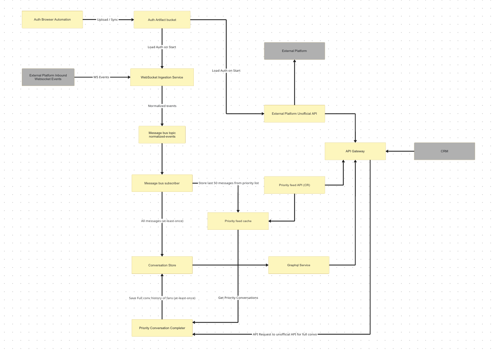

## Overview

This system ingests real-time messaging events from an external platform, persists a complete and correct conversation history, and serves a low-latency “priority feed” for downstream clients (e.g. a CRM).

The architecture is explicitly designed to handle **imperfect upstream delivery**, **eventual consistency**, and **asynchronous repair**, while keeping all read paths fast, predictable, and isolated from external dependencies.

Key goals:
- Low-latency reads for priority conversations
- Durable, correct message history
- No synchronous dependency on unofficial or rate-limited APIs
- Explicit repair paths for partial or missing data

---

## Problem Statement

We needed to support:

- Real-time inbound message events via WebSocket
- Hundreds of inbound events per second during peak activity
- A low-latency priority inbox for operators
- A complete and durable conversation history
- An external platform with:
  - at-least-once and occasionally lossy real-time delivery
  - no official API for full historical message access

A hard constraint was that **user-facing reads must never block on external APIs**, even if data is incomplete.

---

## Core Design Invariants

These invariants guided all architectural decisions:

- The **Conversation Store is the single source of truth**
- The **Priority Feed is a derived, lossy view**
- Reads must **never synchronously depend on external APIs**
- Ingestion is **at-least-once**, with idempotent writes
- Repair and backfill are **asynchronous and isolated**
- Authentication is **centralized, validated continuously, and reused**

---

## High-Level Architecture

At a high level, the system consists of:

### Ingestion
- **WebSocket Ingestion Service**  
  Maintains a real-time connection to the external platform, normalizes inbound events, and publishes them to a message bus.

- **Message Bus (normalized-events topic)**  
  Decouples ingestion from downstream processing and absorbs burst traffic (hundreds of events/sec).

- **Message Bus Subscriber**  
  Consumes events at-least-once and:
  - persists all messages to the conversation store
  - writes a limited priority slice to the priority cache

### Storage
- **Conversation Store**  
  Durable, append-only store containing full conversation history.  
  Idempotency is enforced via ordering and unique message identifiers.

- **Priority Feed Cache**  
  Low-latency cache storing a small, recent subset of priority conversations.

### Serving
- **Priority Feed API**  
  Serves fast reads from the priority cache.

- **GraphQL Service**  
  Read-only API for fetching full conversation history from the conversation store.

### Repair & Backfill
- **Priority Conversation Completer**  
  An asynchronous worker that repairs incomplete conversations by fetching full history from the external platform’s unofficial API.

### Auth & External Access
- **Auth Browser Automation + Artifact Bucket**  
  Centralized authentication acquisition and distribution.
- **External Platform Unofficial API**  
  Used only for backfill and repair, never on the critical read path.

---

## Data Flow Summary

### Real-time ingestion
1. External platform emits WebSocket events.
2. Events are normalized and published to the message bus.
3. Subscriber consumes events at-least-once.
4. Messages are persisted to the conversation store.
5. Priority messages are written to the priority cache.

### Serving reads
- **Priority feed** → served directly from the priority cache
- **Full history** → served from the conversation store via GraphQL

### Repair & backfill
1. Priority feed access identifies incomplete conversations.
2. The Priority Conversation Completer is triggered (poll-based initially).
3. Completer fetches full message history via the unofficial API.
4. Repaired data is persisted to the conversation store.
5. Future reads observe complete data without blocking.

*(Future evolution: event-driven trigger model instead of polling.)*

---

## Delivery, Consistency & Cache Semantics

- Message delivery is **at-least-once**
- Deduplication is enforced in:
  - the message subscriber
  - the conversation store
  - the conversation completer
- Priority cache characteristics:
  - TTL-based eviction (1 hour)
  - Event-driven updates on new messages
  - Fully rebuildable from the conversation store

---

## Failure Handling

The system is designed to degrade gracefully:

- WebSocket drops → repaired via asynchronous backfill
- Duplicate messages → safely deduplicated
- Cache eviction → rebuilt from source of truth
- External API outage → no impact on reads
- Partial data → served immediately and repaired later

---

## Authentication Strategy

Authentication artifacts are:
- Continuously validated on a short interval (minute-level)
- Automatically refreshed on expiry
- Centralized and reused across services

This avoids embedding fragile login logic in runtime services and isolates auth failure modes from user-facing paths.

---

## Why This Design

### Why not fetch full history on read?
Synchronous fetches from an unofficial API would:
- increase tail latency
- introduce external failure coupling
- risk cascading failures under rate limits

Asynchronous repair preserves availability and correctness.

### Why separate priority feed from full history?
Priority reads have fundamentally different latency and freshness requirements. Treating the priority feed as a derived view avoids polluting the source of truth and simplifies correctness guarantees.

---

## Future Improvements

- Event-driven triggering for the conversation completer
- Periodic reconciliation jobs for silent data gaps
- Improved observability around ingest lag and repair rates
- Sharding strategies for higher-scale conversation storage

---

## Key Takeaway

This architecture is designed to be **operable under imperfect conditions**, prioritizing correctness, isolation, and predictable behavior over idealized assumptions about upstream systems.
